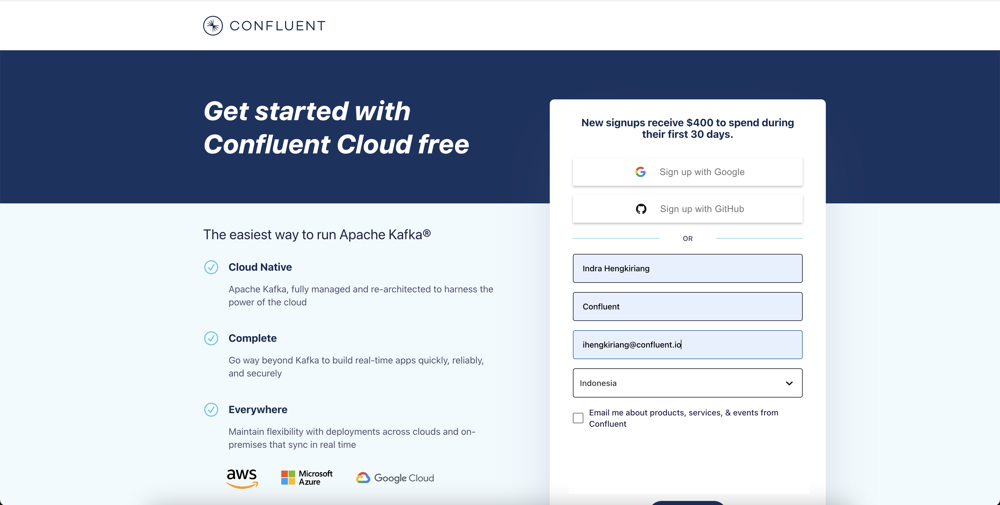
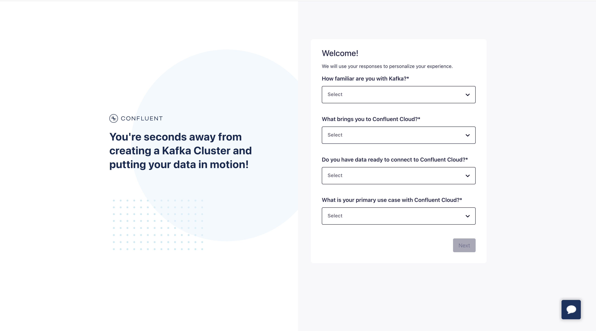
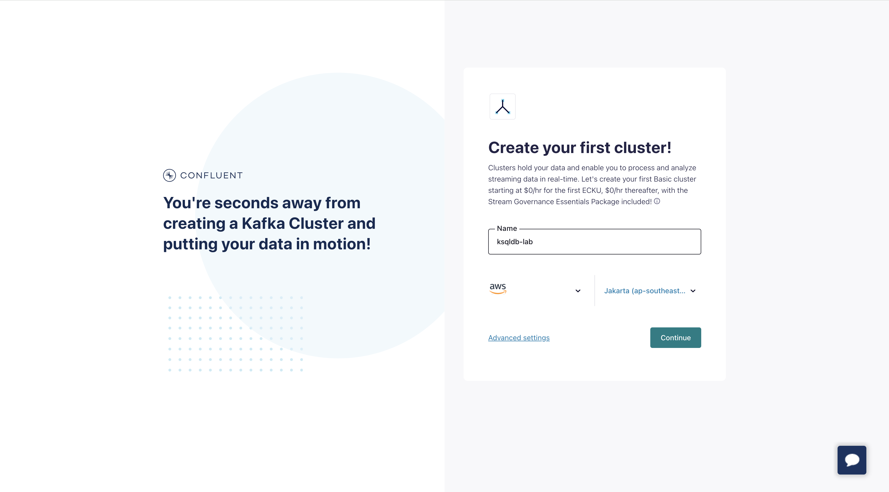
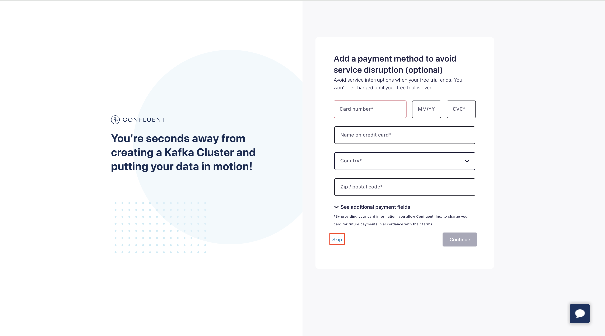

<div align="center" padding=25px>
    
</div>

# <div align="center">Sign-up Confluent Cloud</div>


1. Go to confluent cloud sign-up page
```bash
https://confluent.cloud/signup
```
<div align="center" padding=25px>
    
</div>

2. Fill all the blank and click start free

3. Verify your email address on your email account

4. Setup your Password

5. Fill up the quick survey and click next
<div align="center" padding=25px>
    
</div>

6. Create your Cluster by choosing the Cloud Service Provider and Region with the name of the cluster
<div align="center" padding=25px>
    
</div>

7. Skip the payment
<div align="center" padding=25px>
    
</div>
